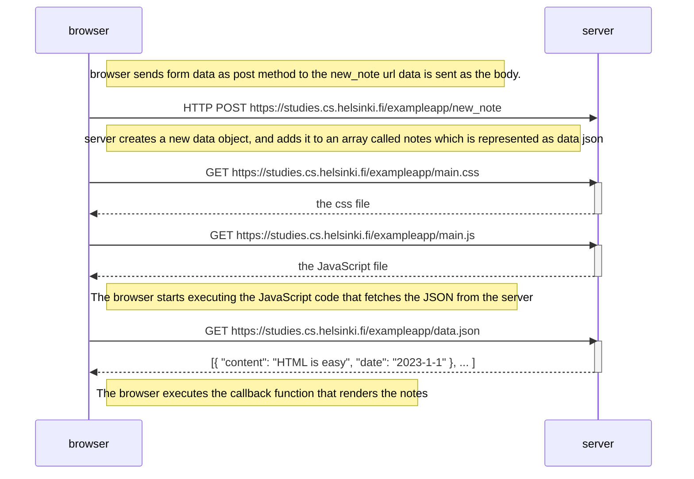

```mermaid
sequenceDiagram
    participant browser
    participant server

    Note right of browser: browser sends form data as post method to the new_note url data is sent as the body.

    browser->>server:HTTP POST https://studies.cs.helsinki.fi/exampleapp/new_note

    Note left of server: server creates a new data object, and adds it to an array called notes which is represented as data json

    browser->>server: GET https://studies.cs.helsinki.fi/exampleapp/main.css
    activate server
    server-->>browser: the css file
    deactivate server

    browser->>server: GET https://studies.cs.helsinki.fi/exampleapp/main.js
    activate server
    server-->>browser: the JavaScript file
    deactivate server

    Note right of browser: The browser starts executing the JavaScript code that fetches the JSON from the server

    browser->>server: GET https://studies.cs.helsinki.fi/exampleapp/data.json
    activate server
    server-->>browser: [{ "content": "HTML is easy", "date": "2023-1-1" }, ... ]
    deactivate server

    Note right of browser: The browser executes the callback function that renders the notes
```
