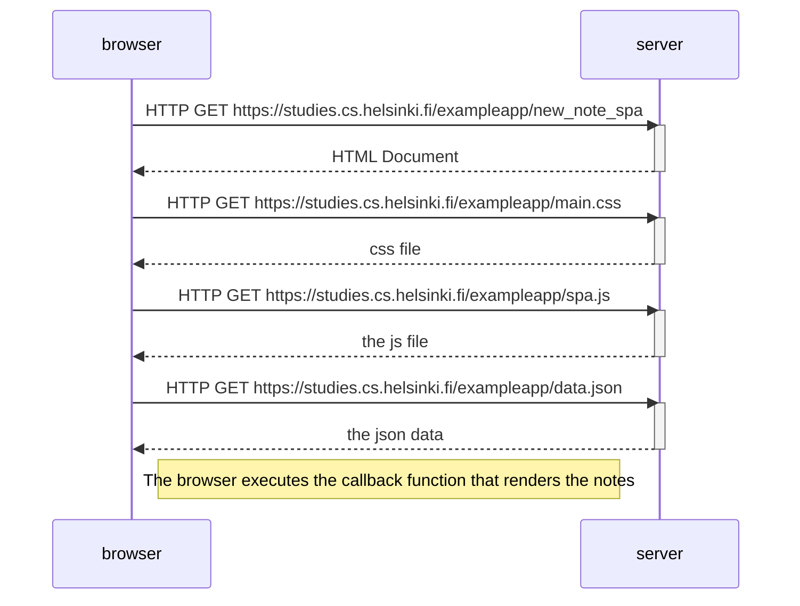

```mermaid
sequenceDiagram
  participant browser
  participant server

  browser->>server:HTTP GET https://studies.cs.helsinki.fi/exampleapp/new_note_spa
  activate server
  server-->>browser: HTML Document
  deactivate server

  browser->> server: HTTP GET https://studies.cs.helsinki.fi/exampleapp/main.css
  activate server
  server-->>browser: css file
  deactivate server

  browser->>server: HTTP GET https://studies.cs.helsinki.fi/exampleapp/spa.js
  activate server
  server-->> browser: the js file
  deactivate server

  browser->>server: HTTP GET https://studies.cs.helsinki.fi/exampleapp/data.json
  activate server
  server-->> browser: the json data
  deactivate server

 Note right of browser: The browser executes the callback function that renders the notes
```
